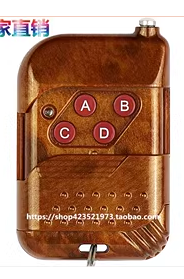
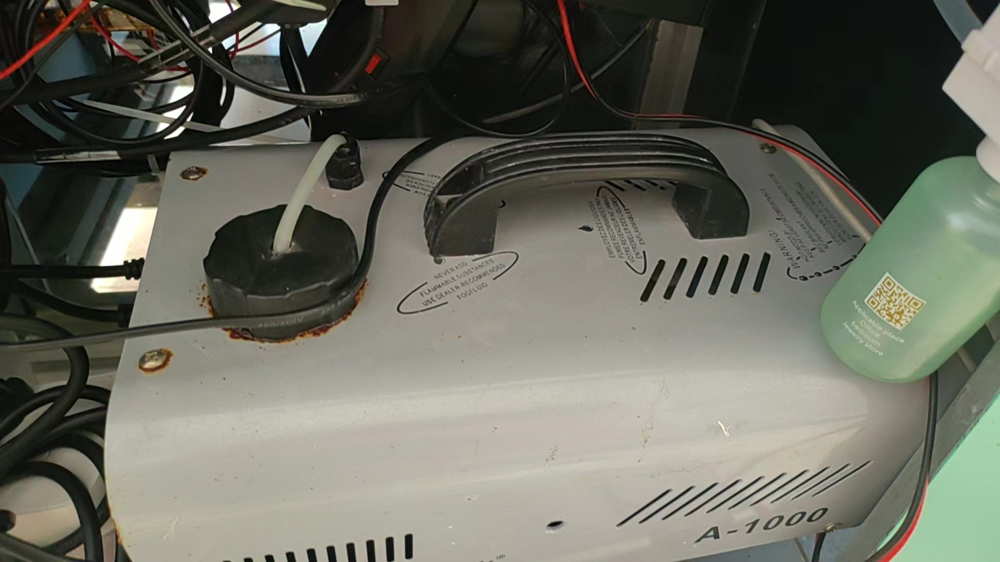

# 大涡环炮使用说明书

## 1. **产品介绍**

**产品名称：大涡环炮**

**主要特点和功能：可发射涡环炮，供娱乐和观赏，吸引顾客。**

**使用场景：景区，商场，游乐园等**

## 2. **安全须知**

- **使用前安全注意事项：设备重量较大，在搬运过程中注意人身安全，避免磕碰。**
- **避免的危险行为和操作：设备上电时，请勿打开设备，若要添加烟油，或气味，设备先断电。**
- **特殊警告和防范措施：请勿把头伸进涡环口。**

## 3. **快速开始**

- **配置和组装说明:设备上电前，请确保设备内有足够的烟油。**
- **产品启动和连接步骤:设备上电后，预热2分钟，上电2分钟后，按下遥控器B位置,大涡环产生烟雾，达到所需烟雾后，松开B位置.再次点击A位置,设备会发射一个大涡环烟圈。**

    

## **4.故障排除**

- **现象：按下B键，设备不产生烟雾**

    **原因1：设备未上电**

    **原因2：设备上电后需预热两分钟后才能使用。**

## 5. **维护和保养**

- **烟雾机内烟油为消耗品，使用完后，需要向烟油壶内添加烟油。下图为烟雾机：逆时针旋转打开黑的的盖子，添加烟油。**

- **烟雾机每用两个月，需要用白醋进行清洗，不然烟雾机内容易造成堵塞，甚至有失灵损坏的风险。清洗方法是：把烟雾机烟油壶内的抽油管插入白醋内，间歇性的按出烟按钮，清洗5分钟左右。**

## 6. **参数**

| 供电电压 | 220V-AC |
| --- | --- |
| 功耗 | 3000W |
| 控制方式 | 315无线遥控器 |

**备注：**

> **若遥控器字符顺序和上图不一致，以上图的位置为准。不以字母为准。**
>
